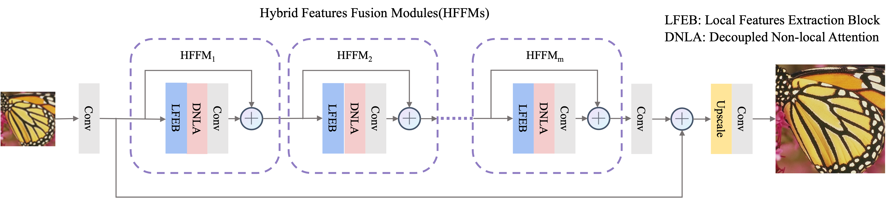
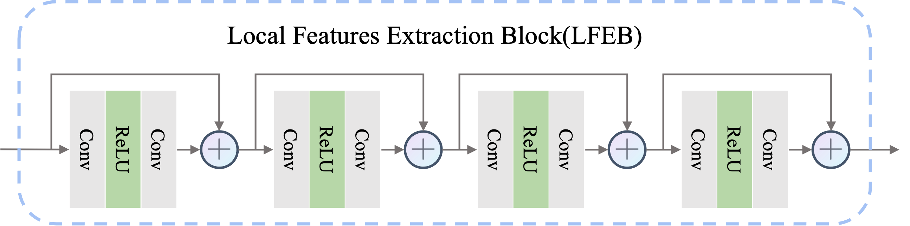

# Decoupled Non-local Attention for Single Image Super-Resolution
This project is for DNLAN introduced in the following paper "Decoupled Non-local Attention for Single Image Super-Resolution", submitted to IEEE Transactions on Instrumentation and Measurement.

The code is test on Ubuntu 20.04 environment (Python3.7, PyTorch >= 1.12.0) with Nvidia 3090 GPUs. 
## Contents
1. [Introduction](#introduction)
2. [Train](#train)
3. [Test](#test)
4. [Acknowledgements](#acknowledgements)

## Introduction

Recently, researchers have shown an increased interest in self-similarity-based deep Single Image Super-Resolution (SISR). The self-similarity is usually captured by the Non-Local Attention (NLA) in deep SISR and achieves satisfactory reconstruction performance. However, we find that the NLA is not efficient in long-range sequence (e.g. SISR) modeling, which is mainly reflected in two aspects: high computational complexity and modeling a large amount of irrelevant non-local features. The reason for these drawbacks is that the NLA needs to calculate the response of each query by summarizing information from all non-local features, which leads to tight coupling of relevant and irrelevant features. To decouple irrelevant features from non-local modeling and reduce computational complexity, we propose a novel Decoupled Non-Local Attention (DNLA). Specifically, our DNLA first leverages FlyHash to generate a binary hash code for each non-local feature, and then only aggregates those non-local features that share the same hash code with the query feature. By constraining the association region of non-local features via FlyHash, our DNLA not only overcomes the drawback of the model for modeling a large number of irrelevant non-local features, but also greatly reduces the computational complexity from quadratic to asymptotic linear with respect to the input image size. Extensive ablation studies validate the high efficiency of our DNLA in capturing non-local information for deep SISR. Based on the DNLA, we construct a deep Decoupled Non-Local Attention Network (DNLAN), which achieves state-of-the-art performance for SISR quantitatively and qualitatively.

The structure of our Decoupled Non-Local Attention Network

The details of Local Features Extraction Block.

An illustration of our Decoupled Non-Local Attention.

## Train
### Prepare training data 

1. Download the training data (800 training + 100 validtion images) from [DIV2K dataset](https://data.vision.ee.ethz.ch/cvl/DIV2K/) or [SNU_CVLab](https://cv.snu.ac.kr/research/EDSR/DIV2K.tar).

2. Unzip the training data into the folder '../SrTrainingData'.

3. Specify '--dir_data' based on the HR and LR images path. 

For more informaiton, please refer to [EDSR(PyTorch)](https://github.com/thstkdgus35/EDSR-PyTorch).

### Begin to train

1. Cd to 'src', run the following script to train models.

    **Example command is in the file 'demo.sh'.**

    ```bash
    # Example X2 SR
    python main.psy --epochs 1500 --model DNLAN --save DNLAN_x2 --data_test Set5 --save_dir ../output/ --dir_data ../../SrTrainingData --n_GPUs 1 --n_threads 8 --rgb_range 1 --save_models --save_results --lr 1e-4 --decay 300-600-900-1200 --chop --n_resgroups 10 --n_resblocks 4 --reduction 2 --n_hashes 3 --n_feats 192 --n_hashlength 7 --res_scale 0.1 --batch_size 16 --scale 2 --patch_size 96 --data_train DIV2K --data_range 1-800/1-5
    ```

## Test
### Quick start
1. Download benchmark datasets from [SNU_CVLab](https://cv.snu.ac.kr/research/EDSR/benchmark.tar)

1. (optional) Download pretrained models for our paper.

    All the models can be downloaded from [Google Drive](https://drive.google.com/drive/folders/1zz2a1ih3euzuH3HvWDN-uSki3USym9Cq?usp=sharing) 

2. Cd to 'src', run the following scripts.

    **Example command is in the file 'demo.sh'.**

    ```bash
    # No self-ensemble: DNLAN
    # Example X4 SR
   python main.py --dir_data ../../SrTrainingData --save_dir ../output/ --model DNLAN  --chunk_size 144 --data_test Set5+Set14+B100+Urban100+Manga109 --n_hashes 3 --n_hashlength 7 --chop --save_results --rgb_range 1 --data_range 801-900 --scale 4 --n_feats 192 --n_resgroups 10 --n_resblocks 4 --reduction 2 --res_scale 0.1  --pre_train ../model/model_x4.pt --test_only
    ```
## Acknowledgements
This code is built on [EDSR](https://github.com/sanghyun-son/EDSR-PyTorch) and [Fly-LSH](https://github.com/dataplayer12/Fly-LSH). We thank the authors for sharing their codes.